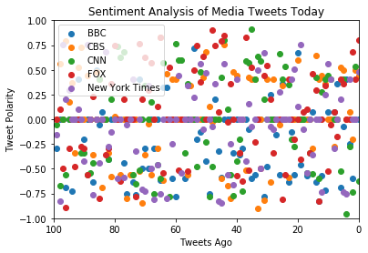
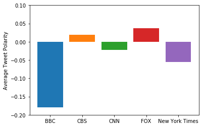

```python
# Three Observable Trends
# The aggregate of each news organization's tweets is consitently close to neutral.
# The BBC had tweets with the most negative overall sentiment and CBS had tweets closest to neutral. 
# All news organizations had a wide spread of tweet sentiments reaching high and low on the scale. 
```


```python
import tweepy
import json
from config4 import access_token, access_token_secret, consumer_key, consumer_secret
from pprint import pprint
from vaderSentiment.vaderSentiment import SentimentIntensityAnalyzer
import matplotlib.pyplot as plt
import numpy as np
import pandas as pd
analyzer = SentimentIntensityAnalyzer()
```


```python
auth = tweepy.OAuthHandler(consumer_key, consumer_secret)
auth.set_access_token(access_token, access_token_secret)
api = tweepy.API(auth, parser=tweepy.parsers.JSONParser())
```


```python
# Define which Twitter accounts to pull from: 
news_organizations = ['BBCWorld', 'CBSNews', 'CNN', 'FoxNews', 'NYTIMES']
```


```python
# Grab the Vader Analysis scores for the most recent 100 tweets for each account:
source = []
tweet_times = []
tweet_text = []

comp_scores = []
pos_scores = []
neu_scores = []
neg_scores = []

for account in news_organizations: 
    public_tweets = api.user_timeline(account, count=100)
    for tweet in public_tweets:
        
        source.append(account)
        tweet_times.append(tweet['created_at'])
        tweet_text.append(tweet['text'])
        
        #Analyzed Data
        analyzed = analyzer.polarity_scores(tweet['text'])
        comp_scores.append(analyzed['compound'])
        pos_scores.append(analyzed['pos'])
        neu_scores.append(analyzed['neu'])
        neg_scores.append(analyzed['neg'])
```


```python
# Add all of the data into a dataframe. 

analysis_df = pd.DataFrame(data= source, columns=["Source"])
analysis_df['Time Stamp'] = tweet_times
analysis_df['Tweet Text'] = tweet_text
analysis_df['Compound Score'] = comp_scores
analysis_df['Positive Score'] = pos_scores
analysis_df['Neutral Score'] = neu_scores
analysis_df['Negative Score'] = neg_scores
analysis_df.to_csv("tweet_sentiment_analysis.csv")
analysis_df.head()
```


<div>
<style scoped>
    .dataframe tbody tr th:only-of-type {
        vertical-align: middle;
    }

    .dataframe tbody tr th {
        vertical-align: top;
    }

    .dataframe thead th {
        text-align: right;
    }
</style>
<table border="1" class="dataframe">
  <thead>
    <tr style="text-align: right;">
      <th></th>
      <th>Source</th>
      <th>Time Stamp</th>
      <th>Tweet Text</th>
      <th>Compound Score</th>
      <th>Positive Score</th>
      <th>Neutral Score</th>
      <th>Negative Score</th>
    </tr>
  </thead>
  <tbody>
    <tr>
      <th>0</th>
      <td>BBCWorld</td>
      <td>Wed Mar 14 03:15:15 +0000 2018</td>
      <td>RT @BBCNewsAsia: Peak foodie. The table where ...</td>
      <td>0.0000</td>
      <td>0.000</td>
      <td>1.000</td>
      <td>0.000</td>
    </tr>
    <tr>
      <th>1</th>
      <td>BBCWorld</td>
      <td>Wed Mar 14 02:51:14 +0000 2018</td>
      <td>Test election held for Pennsylvania seat https...</td>
      <td>0.0000</td>
      <td>0.000</td>
      <td>1.000</td>
      <td>0.000</td>
    </tr>
    <tr>
      <th>2</th>
      <td>BBCWorld</td>
      <td>Wed Mar 14 02:43:09 +0000 2018</td>
      <td>South Korea gaming: Death by overwork sparks c...</td>
      <td>-0.5994</td>
      <td>0.000</td>
      <td>0.719</td>
      <td>0.281</td>
    </tr>
    <tr>
      <th>3</th>
      <td>BBCWorld</td>
      <td>Wed Mar 14 02:35:11 +0000 2018</td>
      <td>How Russia uses propaganda to discredit oppone...</td>
      <td>-0.2500</td>
      <td>0.000</td>
      <td>0.778</td>
      <td>0.222</td>
    </tr>
    <tr>
      <th>4</th>
      <td>BBCWorld</td>
      <td>Wed Mar 14 02:23:31 +0000 2018</td>
      <td>El Salvador woman freed after 15 years in jail...</td>
      <td>0.4019</td>
      <td>0.197</td>
      <td>0.803</td>
      <td>0.000</td>
    </tr>
  </tbody>
</table>
</div>


```python
# Separate the scores into individual lists by organization: 

bbc_tweet_scores = comp_scores[0:100]
cbs_tweet_scores = comp_scores[100:200]
cnn_tweet_scores = comp_scores[200:300]
fox_tweet_scores = comp_scores[300:400]
nytimes_tweet_scores = comp_scores[400:500]
```


```python
# Graph the Compound Sentiment Scores in a Scatter Plot

x_values = np.arange(0,len(bbc_tweet_scores), 1)
plt.scatter(x_values, bbc_tweet_scores, label = "BBC")
plt.scatter(x_values, cbs_tweet_scores, label = "CBS")
plt.scatter(x_values, cnn_tweet_scores, label = "CNN")
plt.scatter(x_values, fox_tweet_scores, label = "FOX")
plt.scatter(x_values, nytimes_tweet_scores, label = "New York Times")


plt.legend()
plt.title("Sentiment Analysis of Media Tweets Today")
plt.xlabel("Tweets Ago")
plt.ylabel("Tweet Polarity")
plt.xlim(100, 0)
plt.ylim(-1,1)
plt.show()
plt.savefig("sentiment_analysis_over_time.png")

```





```python
# Graph Average of Compound Sentiment Scores in a Bar Chart

names = ["BBC", "CBS", "CNN", "FOX", "New York Times"]
x_pos = np.arange(len(names))
plt.bar(0, np.mean(bbc_tweet_scores))
plt.bar(1, np.mean(cbs_tweet_scores))
plt.bar(2, np.mean(cnn_tweet_scores))
plt.bar(3, np.mean(fox_tweet_scores))
plt.bar(4, np.mean(nytimes_tweet_scores))
plt.xticks(x_pos, names)
plt.ylabel("Average Tweet Polarity")
plt.ylim(-.2, .1)
plt.show()
plt.savefig("tweet_polarity_by_organization")
```




